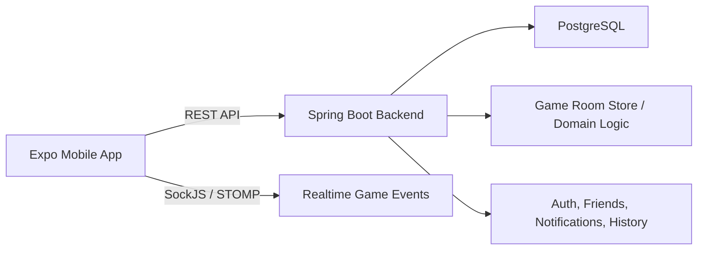

# Mafia Mobile

Mobile companion app and backend server for hosting offline Mafia games with live room management, role-based gameplay, social features, and match history.

## Overview

This project helps players organize and run Mafia games from a phone instead of managing everything manually.  
It combines:

- a **React Native / Expo** mobile app for players and hosts;
- a **Spring Boot** backend for authentication, social features, game state, notifications, and history;
- **WebSocket-based live updates** for room and game events.

The app is designed for in-person play, where the phone supports the game flow, while the players are physically together.

## What The App Can Do

- Register and log in with token-based authentication
- Edit profile, avatar, and role preferences
- Search users and manage friendships
- Accept, reject, cancel, and remove friend relationships
- Create Mafia rooms with configurable role composition
- Join rooms by code / QR flow
- Invite friends into a lobby
- Start and manage a live game session
- Receive real-time game updates over WebSockets
- Track notifications for friend activity and game invitations
- View rating tables
- Browse finished game history and details

## Architecture



## Tech Stack

### Mobile

- Expo
- React Native
- Expo Router
- TypeScript
- React Navigation
- SockJS + STOMP

### Backend

- Java 17
- Spring Boot 4
- Spring Web MVC
- Spring Security
- Spring Data JPA
- Spring WebSocket
- PostgreSQL
- H2 for tests

## Repository Structure

```text
.
|-- backend/   # Spring Boot API, game logic, persistence, auth, notifications
|-- mobile/    # Expo / React Native client
`-- README.md
```

## Core Functional Areas

### Authentication

- JWT-based login and refresh flow
- Secure token storage on mobile
- Protected API access

### Friends And Social

- User search
- Incoming and outgoing requests
- Friend approvals and removals
- Profile viewing for other users

### Game Flow

- Room creation
- Lobby readiness
- Friend invitations
- Day / night / voting phases
- Role-specific actions
- Live synchronization between players

### History And Rating

- Persistent finished game snapshots
- Detailed vote history
- Global and friends-only rating views

## Getting Started

### 1. Clone the repository

```bash
git clone <your-repo-url>
cd gitrepo
```

### 2. Start PostgreSQL

The backend currently expects a local PostgreSQL database:

- database: `mafia`
- host: `localhost`
- port: `5432`

Current backend config is stored in `backend/src/main/resources/application.properties`.

If needed, create the database first:

```sql
CREATE DATABASE mafia;
```

### 3. Run the backend

Requirements:

- Java 17
- Maven
- PostgreSQL

Commands:

```bash
cd backend
mvn spring-boot:run
```

By default the backend starts on:

```text
http://localhost:8080
```

### 4. Run the mobile app

Requirements:

- Node.js
- npm
- Expo CLI tooling
- Android Studio emulator or Expo Go

Commands:

```bash
cd mobile
npm install
npx expo start
```

Useful alternatives:

```bash
npm run android
npm run web
```

The mobile app targets `http://localhost:8080` by default.  
You can also override the backend URL with:

```bash
EXPO_PUBLIC_API_URL=http://<your-ip>:8080
```

## Development Notes

- The mobile client uses Expo Router for file-based navigation.
- Realtime room/game updates are delivered via SockJS/STOMP.
- The backend stores users and social data in PostgreSQL.
- Test runs use an in-memory H2 database.
- Hibernate schema update is currently enabled for local development.

## Testing

### Backend

```bash
cd backend
mvn test
```

### Mobile

```bash
cd mobile
npx tsc --noEmit
npm run lint
```

## API Highlights

Examples of implemented backend areas:

- `/auth/*`
- `/users/me`
- `/users/search`
- `/friends/*`
- `/notifications/*`
- `/rating`
- `/game/rooms/*`
- `/games/history/*`

## Current Project Status

This repository already contains a working end-to-end prototype with:

- authentication;
- profile editing;
- friends and notifications;
- room and game lifecycle;
- realtime updates;
- rating and history screens.

It is well suited for coursework, demos, and further iteration.

## Suggested Future Improvements

- Move database credentials and secrets to environment variables
- Add Docker / docker-compose setup
- Add CI checks for backend and mobile
- Add screenshots / demo GIFs to the README
- Add Swagger / OpenAPI documentation
- Expand automated frontend testing

## Screens To Highlight In Future README Updates

If you want to make the repository even more attractive on GitHub later, the next best addition would be:

- login / registration
- lobby screen
- active game screen
- friends screen
- notifications screen
- rating screen

## Author

Course project for an offline Mafia game hosting platform.
