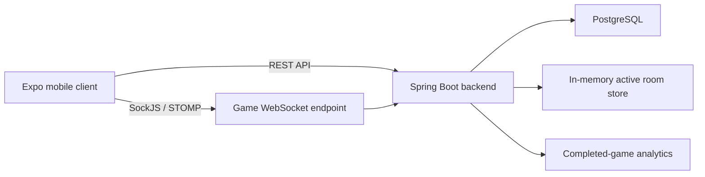

# Mafia Mobile

Premium-style mobile companion app and Spring Boot backend for hosting offline Mafia games with live room state, QR invites, private clubs, player dossiers, match recaps, ratings, and persistent game history.

The product is designed for in-person play: the phone supports the host, synchronizes the table, preserves the aftergame archive, and gives players a more polished identity around recurring sessions.

## Project At A Glance

- `mobile/`: Expo React Native client with file-based routing, authenticated API access, QR/deeplink room joining, live game screens, role gallery, dossiers, clubs, history, and profile management.
- `backend/`: Spring Boot API with authentication, friends, clubs, notifications, game-room lifecycle, WebSocket game events, completed-game history, recaps, and dossier analytics.
- `PostgreSQL`: main persistence store for users, refresh tokens, friendships, notifications, clubs, memberships, and completed game snapshots.


```mermaid
flowchart LR
    A["Expo mobile client"] -->|"REST API"| B["Spring Boot backend"]
    A -->|"SockJS / STOMP"| C["Game WebSocket endpoint"]
    C --> B
    B --> D["PostgreSQL"]
    B --> E["In-memory active room store"]
    B --> F["Completed-game analytics"]
```

## Flagship Features

- Authentication with JWT access tokens and server-side refresh tokens.
- Player profiles with avatars, rating, language, unique nicknames, and live nickname availability checks.
- Friends system with incoming, outgoing, approved, rejected, cancelled, and removal flows.
- Private Clubs for multiple real-life play groups, club invites, club-linked rooms, club members, and club history.
- Configurable Mafia rooms with role slots, readiness, friend invites, QR/deeplink joining, and host controls.
- Live game flow with day, voting, night, role actions, private role delivery, discussion queue, and WebSocket synchronization.
- Role gallery with full-screen carousel cards and matching in-game role reveal cards.
- Completed game archive with detailed vote history, survivors, and editorial Signature Recaps.
- Player Dossiers with recent form, role mastery, voting intelligence, table statistics, and frequent tablemates.
- Notifications for friend requests, game invites, and club invites.
- Global and friends-only rating views.
- Request logging with request ids and rolling backend log files.

## Tech Stack

**Mobile**

- Expo 55
- React 19
- React Native 0.83
- Expo Router
- TypeScript
- React Navigation
- React Native Reanimated / Worklets
- SockJS + STOMP
- Expo Secure Store, Camera, Image Picker, Linking

**Backend**

- Java 17
- Spring Boot 4
- Spring Web MVC
- Spring Security
- Spring Data JPA
- Spring WebSocket
- PostgreSQL
- JJWT
- H2 for tests

## Repository Structure

```text
.
|-- backend/
|   |-- src/main/java/alafonin4/mafia/
|   |-- src/main/resources/application.properties
|   |-- src/test/java/alafonin4/mafia/
|   |-- pom.xml
|   `-- README.md
|-- mobile/
|   |-- src/app/
|   |-- src/components/
|   |-- src/utils/
|   |-- app.json
|   |-- package.json
|   `-- README.md
`-- README.md
```

## Quick Start

### 1. Start PostgreSQL

Create a database for local development:

```sql
CREATE DATABASE mafia;
```

The backend reads database settings from environment variables:

```bash
SPRING_DATASOURCE_URL=jdbc:postgresql://localhost:5432/mafia
SPRING_DATASOURCE_USERNAME=<your_username>
SPRING_DATASOURCE_PASSWORD=<your_password>
PORT=8080
```

### 2. Run The Backend

```bash
cd backend
mvn spring-boot:run
```

The API starts on:

```text
http://localhost:8080
```

For a physical phone on the same Wi-Fi network, use the laptop IP address instead of `localhost`, for example:

```text
http://192.168.1.20:8080
```

### 3. Run The Mobile Client

```bash
cd mobile
npm install
npx expo start
```

To point the mobile client at a local backend:

```bash
EXPO_PUBLIC_API_URL=http://192.168.1.20:8080 npx expo start
```

If `EXPO_PUBLIC_API_URL` is not set, the client falls back to the deployed backend configured in `mobile/src/utils/api/base-url.ts`.

## Production / APK Notes

The Android package id is configured as:

```text
com.alafonin4.mafiaapp
```

Useful EAS commands:

```bash
cd mobile
eas build --platform android --profile preview
eas build --platform android --profile production --clear-cache
```

The Android config currently allows cleartext traffic so a phone can call a local `http://<laptop-ip>:8080` backend during testing.

## Testing

Backend:

```bash
cd backend
mvn test
```

Mobile:

```bash
cd mobile
npx tsc --noEmit
npm run lint
```

## Main API Areas

- `POST /auth/register`, `POST /auth/login`, `POST /auth/refresh`, `POST /auth/logout`
- `GET /users/me`, `PUT /users/update`, `GET /users/search`
- `GET /users/me/dossier`, `GET /users/{id}/dossier`
- `GET /users/nickname-availability`
- `GET /rating`
- `/friends/*`
- `/clubs/*`
- `/notifications/*`
- `/game/roles/*`
- `/game/rooms/*`
- `/games/history/*`
- `SockJS / STOMP /ws-game`

## Documentation

- Mobile client details: [mobile/README.md](mobile/README.md)
- Backend details: [backend/README.md](backend/README.md)

## Development Notes

- Active game rooms are kept in an in-memory room store. Completed games are persisted as snapshots for history and analytics.
- Dossiers and recaps are calculated from existing completed-game snapshots rather than separate analytics tables.
- Hibernate `ddl-auto=update` is enabled for local development convenience.
- Backend logs are written to `backend/logs/mafia-backend.log`.
- Before using this as a public production service, externalize the JWT signing secret and review production database, CORS, and deployment settings.

## Project Status

The repository contains a working end-to-end course project with a richer product layer already in place: social graph, clubs, live rooms, gameplay, history, analytics, and premium-feeling mobile surfaces. It is ready for demo builds, coursework defense, and further iteration.
